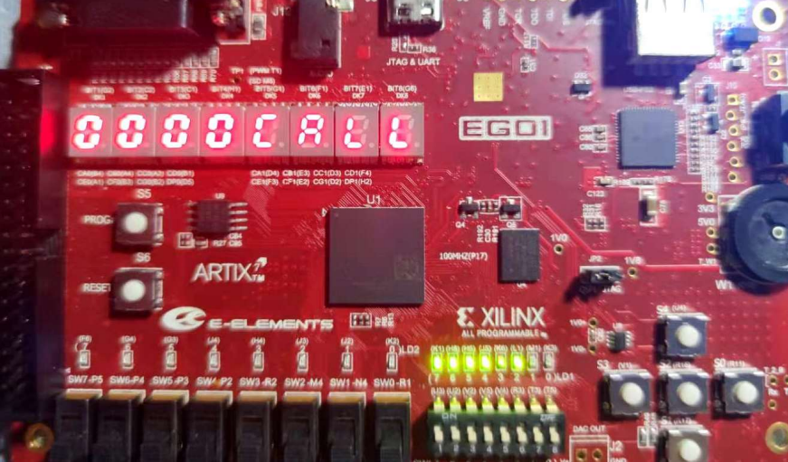
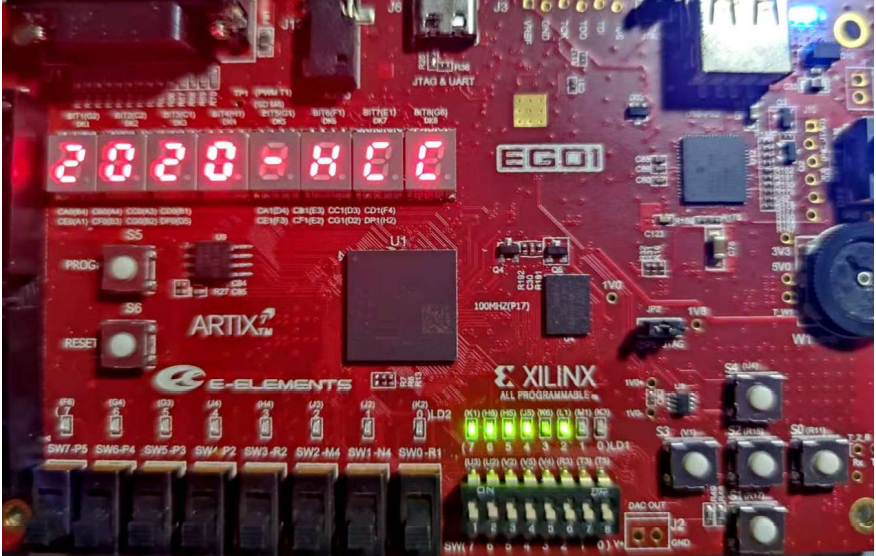
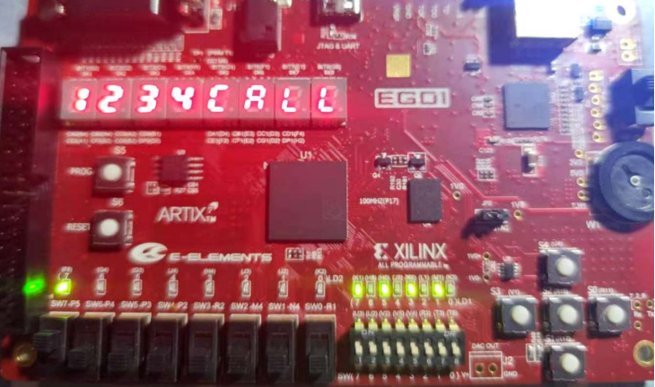
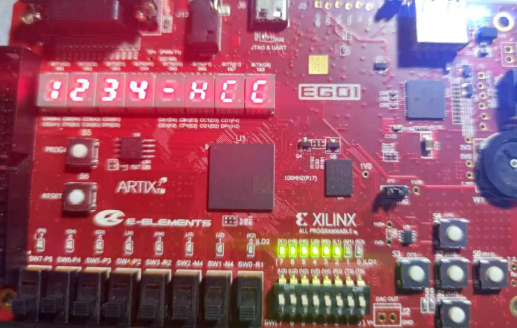
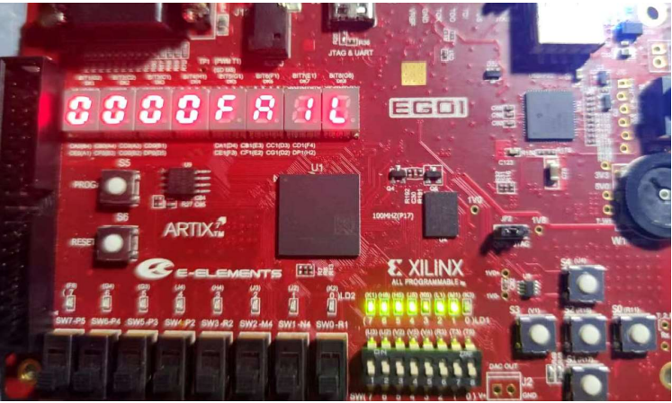

# EGo1-Vivado-Lock
FPGA设计，借助Vivado和Ego1实验平台设计的密码锁[内附报告]（FPGA design, password lock designed by vivado and ego1 experimental platform [attached report]）

## 实验环境  

- 操作系统：Window 10；  
- 设计软件：Vivado 2017.4；  
- 硬件平台：Ego1； 

## 实现功能

- 准备解锁时，显示 CALL 字符等待输入

- 成功解锁

- 调节按钮 SW7（左下角按钮上拉，相应 LED 点亮，流水灯切换为间隔亮灯）， 此时调节每位密码数值设置锁的密码

- 设置完后返回正常解锁模式测试，输入 1234 成功解锁，返回-HCC

- 超过 20 秒未输入正确密码，密码锁将锁死，返回 FAIL

## 详细介绍

- 见[实验报告](./移动通信网络实验报告.pdf)

© JackHCC

